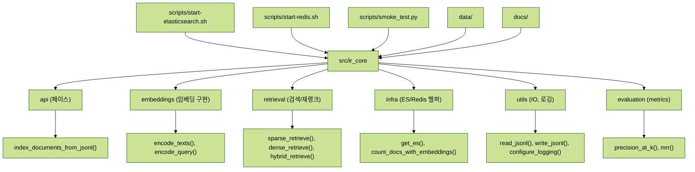
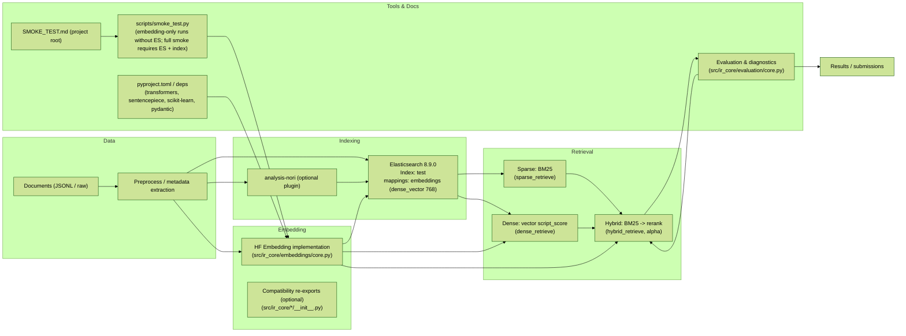

# Information Retrieval — 프로젝트 템플릿

팀, 환경, 데이터 및 실행 방법을 담은 템플릿 README입니다.

## 팀

|  |  |  |  |  |
| :--------------------------------------------------------------: | :--------------------------------------------------------------: | :--------------------------------------------------------------: | :--------------------------------------------------------------: | :--------------------------------------------------------------: |
|            [박패캠](https://github.com/UpstageAILab)             |            [이패캠](https://github.com/UpstageAILab)             |            [최패캠](https://github.com/UpstageAILab)             |            [김패캠](https://github.com/UpstageAILab)             |            [오패캠](https://github.com/UpstageAILab)             |
|                            팀장, 담당 역할                             |                            담당 역할                             |                            담당 역할                             |                            담당 역할                             |                            담당 역할                             |

## 0. 개요
### 환경
- 개발 OS: Ubuntu 20.04 (권장)
- Python: 3.10 (Poetry를 사용한 의존성 관리)
- 필수 도구: curl, tar, make, gcc (Redis 빌드 대체용)

### 요구사항
- Python 의존성은 `pyproject.toml`을 참조하세요. 다음 명령으로 설치하세요:

```bash
poetry install
```

## 1. 대회 정보

### 개요

이 저장소는 과학적 상식 검색 작업을 위한 모듈형 RAG 파이프라인 골격을 제공합니다. Elasticsearch + Redis를 인덱싱 및 캐싱에 지원하며, 임베딩, 인덱싱, 검색 및 평가를 위한 유틸리티를 포함합니다.

### 일정

- 시작 날짜: YYYY-MM-DD
- 최종 제출: YYYY-MM-DD

## 2. 구성 요소

### 디렉터리

```
.
├── README.md
├── pyproject.toml
├── poetry.lock
├── data/
│   ├── documents.jsonl
│   └── eval.jsonl
├── src/
│   └── ir_core/
│       ├── __init__.py
│       ├── api.py
│       ├── config/
│       │   └── __init__.py
│       ├── embeddings/
│       │   ├── __init__.py
│       │   └── core.py
│       ├── retrieval/
│       │   ├── __init__.py
│       │   └── core.py
│       ├── infra/
│       │   └── __init__.py
│       ├── utils/
│       │   ├── __init__.py
│       │   └── core.py
│       └── evaluation/
│           ├── __init__.py
│           └── core.py
├── scripts/
│   ├── start-elasticsearch.sh
│   ├── start-redis.sh
│   └── smoke_test.py
|
├── docs/
│   └── notes/
└── SMOKE_TEST.md
```
## 3. 데이터 설명

## 프로젝트 구조

아래는 주요 디렉터리와 컴포넌트의 개요입니다.



위 다이어그램은 프로젝트의 논리적 연결을 단순히 보여줍니다: `src/ir_core`의 `api`가 핵심 페사드 역할을 하고, 하위 패키지들이 실제 구현을 제공합니다. `scripts/`는 로컬 서비스 시작 및 스모크 테스트를 담당합니다.

`data/documents.jsonl` 및 `data/eval.jsonl`의 예시를 참조하세요. `docs/notes/project-overview.md`의 프로젝트 개요에는 데이터셋, EDA 및 평가 메트릭(MAP)에 대한 자세한 내용이 포함되어 있습니다.

## 프로젝트 아키텍처 — RAG 파이프라인



## 4. 모델링

모델링 세부 사항(임베딩 모델, 밀집/희소 검색 선택, 재순위화)은 `docs/` 및 `notebooks/`의 해당 노트북에 문서화되어야 합니다.

## 5. 결과

리더보드 스크린샷, 모델 성능 및 프레젠테이션 파일을 여기에 포함하세요.

## Docker 없이 서비스 실행 (로컬 개발)

이 저장소에는 로컬 개발을 위한 Elasticsearch 및 Redis를 Docker 없이 실행하는 도우미 스크립트가 `scripts/`에 포함되어 있습니다. 자세한 내용은 `docs/docker-less.md`를 참조하세요. 빠른 명령:

```bash
# 백그라운드 서비스 시작 (필요 시 다운로드)
./scripts/start-elasticsearch.sh
./scripts/start-redis.sh --prebuilt

# 스모크 테스트 실행 (서비스 시작, 엔드포인트 확인 후 중지)
./scripts/smoke-test.sh

# 다운로드된 배포판 정리
./scripts/cleanup-distros.sh

# systemd 사용자 서비스 설치
./scripts/manage-services.sh install
./scripts/manage-services.sh status
./scripts/manage-services.sh uninstall
```

## 사용법 (한국어)

간단한 로컬 개발 워크플로우입니다. 이 프로젝트는 Elasticsearch와 Redis를 서비스로 사용합니다. 아래 순서대로 진행하세요.

1) 의존성 설치 (Poetry 사용)

```bash
poetry install
```

2) Elasticsearch 시작

```bash
./scripts/start-elasticsearch.sh
# 또는 시스템에 이미 elasticsearch가 설치되어 있으면 --prebuilt 옵션 사용
```

3) Redis 시작

```bash
./scripts/start-redis.sh
# 또는 시스템 바이너리 사용
./scripts/start-redis.sh --prebuilt
```

4) 인덱스 생성 / 문서 색인

스모크 테스트는 기본적으로 `settings.INDEX_NAME` (기본값: `test`) 인덱스를 사용합니다. 만약 인덱스가 없어서 `index_not_found_exception`이 발생하면, 먼저 인덱스를 생성하거나 예제 문서를 색인하세요. 예를 들어 `data/documents.jsonl`을 사용해 색인하려면:

```bash
poetry run python - <<'PY'
from ir_core import api
api.index_documents_from_jsonl('data/documents.jsonl', index_name='test')
print('Indexed sample documents into index: test')
PY
```

위 방법은 아주 작은 편의 스크립트입니다. 프로덕션 환경에서는 매핑, 분석기, 템플릿을 주의해서 설정하세요.

5) 스모크 테스트 실행

```bash
poetry run python scripts/smoke_test.py
```

실행 중 모델 가중치를 처음 다운로드하면 시간이 걸립니다. 만약 `ConnectionRefusedError` 또는 `index_not_found_exception`이 발생하면 서비스가 제대로 실행 중인지 (`./scripts/start-elasticsearch.sh`, `./scripts/start-redis.sh`)와 인덱스가 생성/색인되었는지 확인하세요.

문제가 계속되면 로그를 확인하세요:

- Elasticsearch 로그: `elasticsearch-*/logs/`
- Redis 로그: `redis-*/logs/`


## 참고사항
- 이 프로젝트는 원래 Windows 빌드 Elasticsearch 번들을 포함했으나 제거되었습니다; 프로덕션 패리티를 위해 공식 Linux tarball 또는 Docker 이미지를 선호하세요.

## 프로젝트 개요 (대회별 세부 사항)

`docs/notes/project-overview.md`에서 데이터셋 통계(인덱싱용 4,272개 문서; 220개 평가 메시지), 평가 방법(MAP) 및 RAG 아키텍처 노트를 포함한 전체 대회 작성본을 참조하세요.

## 권장 임포트 경로 (중요)

이 저장소는 리팩터링을 거쳐 구현을 하위 패키지로 이동시켰습니다. 혼란을 줄이기 위해 아래 권장 경로를 사용하세요.

- 전체 페사드(추천):
  - `from ir_core.api import index_documents_from_jsonl, encode_texts, sparse_retrieve`
- 임베딩 직접 사용:
  - `from ir_core.embeddings.core import encode_texts, encode_query`
- 검색/재랭크:
  - `from ir_core.retrieval.core import sparse_retrieve, dense_retrieve, hybrid_retrieve`
- 유틸/IO:
  - `from ir_core.utils.core import read_jsonl, write_jsonl`
- 인프라(Elasticsearch):
  - `from ir_core.infra import get_es, count_docs_with_embeddings`
- 설정:
  - `from ir_core.config import settings`

참고: 일부 오래된(레거시) 모듈 및 호환성 셈(예: `ir_core.embeddings`, `ir_core.retrieval`, `ir_core.utils`, `ir_core.es_client`, `ir_core.eval`, `ir_core.config`(모듈형))은 제거되었거나 더 이상 권장되지 않습니다. 기존 코드를 사용하는 경우 위 권장 경로로 임포트 경로를 업데이트하세요.
