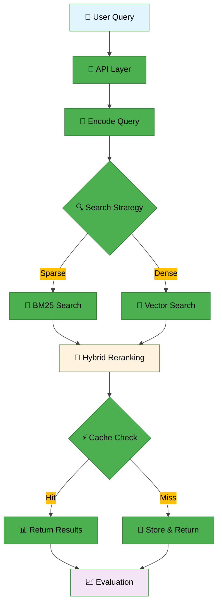

# Information Retrieval

> 과학적 상식 검색을 위한 모듈형 RAG 파이프라인

---
## 👥 팀 소개
<table>
    <tr>
        <td align="center"></td>
        <td align="center"></td>
        <td align="center"></td>
        <td align="center"></td>
        <td align="center"></td>
    </tr>
    <tr>
        <td align="center"><a href="https://github.com/YOUR_GITHUB">AI13_이상원</a></td>
        <td align="center"><a href="https://github.com/YOUR_GITHUB">AI13_김효석</a></td>
        <td align="center"><a href="https://github.com/Wchoi189">AI13_최용비</a></td>
        <td align="center"><a href="https://github.com/YOUR_GITHUB">AI13_강연경</a></td>
        <td align="center"><a href="https://github.com/YOUR_GITHUB">AI13_정재훈</a></td>
    </tr>
    <tr>
        <td align="center">검색 알고리즘 최적화</td>
        <td align="center">툴 연동, 평가 검증</td>
        <td align="center">베이스라인 제작, readme 작성</td>
        <td align="center">모델 최적화, 프롬트 엔지니어링</td>
        <td align="center">API 개발, Steamlit UI</td>
    </tr>
</table>

---

## 📋 목차

- [개요](#-개요)
- [대회 정보](#-대회-정보)
- [프로젝트 구조](#-프로젝트-구조)
- [아키텍처](#-아키텍처)
- [설치 및 실행](#-설치-및-실행)
- [사용법](#-사용법)
- [결과](#-결과)

---

## 🎯 개요

### 환경 요구사항

| 구분 | 사양 |
|------|------|
| **OS** | Ubuntu 20.04 (권장) |
| **Python** | 3.10 |
| **의존성 관리** | Poetry |
| **필수 도구** | curl, tar, make, gcc |

### 주요 기능

- ✅ Elasticsearch + Redis 기반 인덱싱 및 캐싱
- ✅ 모듈형 RAG 파이프라인
- ✅ 임베딩, 검색, 평가 유틸리티 제공
- ✅ Docker 없는 로컬 개발 환경 지원

---

## 🏆 대회 정보

### 📊 개요
과학적 상식 검색 작업을 위한 Information Retrieval 시스템 구축

### 📅 일정
- **시작 날짜**: 2025-09-08
- **최종 제출**: 2025-09-18 (19:00)

### 📈 평가 지표
- **주요 지표**: MAP (Mean Average Precision)
- **데이터셋**: 인덱싱용 4,272개 문서, 평가용 220개 쿼리

---

## 📁 프로젝트 구조

```
📦 프로젝트 루트
├── 📄 README.md
├── 📄 SMOKE_TEST.md
├── 📄 pyproject.toml
├── 📄 poetry.lock
│
├── 📂 conf/
│   ├── 📄 config.yaml
│   ├── 📄 elasticsearch.yml
│   └── 📄 redis.conf
│
├── 📂 data/
│   ├── 📄 documents.jsonl
│   ├── 📄 eval.jsonl
│   ├── 📂 raw/
│   └── 📂 processed/
│
├── 📂 docs/
│   ├── 📂 assets/
│   │   ├── 📂 images/
│   │   └── 📂 diagrams/
│   ├── 📂 notes/
│   │   ├── 📄 project-overview.md
│   │   ├── 📄 architecture.md
│   │   └── 📄 evaluation.md
│   └── 📂 usage/
│       ├── 📄 installation.md
│       ├── 📄 quickstart.md
│       └── 📄 troubleshooting.md
│
├── 📂 notebooks/
│   ├── 📄 01_data_exploration.ipynb
│   ├── 📄 02_embedding_analysis.ipynb
│   ├── 📄 03_retrieval_experiments.ipynb
│   └── 📄 04_evaluation_results.ipynb
│
├── 📂 scripts/
│   ├── 🔧 cleanup-distros.sh
│   ├── 🔧 manage-services.sh
│   ├── 🔧 smoke-test.sh
│   ├── 🔧 smoke_test.py
│   ├── 🔧 start-elasticsearch.sh
│   └── 🔧 start-redis.sh
│
└── 📂 src/
    └── 📂 ir_core/
        ├── 📄 __init__.py
        ├── 📂 api/
        │    └──📄 __init__.py
        ├── 📂 config/
        │   ├── 📄 __init__.py
        │   └── 📄 settings.py
        ├── 📂 embeddings/
        │   ├── 📄 __init__.py
        │   └── 📄 core.py
        ├── 📂 evaluation/
        │   ├── 📄 __init__.py
        │   └── 📄 core.py
        ├── 📂 infra/
        │   ├── 📄 __init__.py
        │   ├── 📄 elasticsearch.py
        │   └── 📄 redis.py
        ├── 📂 retrieval/
        │   ├── 📄 __init__.py
        │   └── 📄 core.py
        └── 📂 utils/
            ├── 📄 __init__.py
            ├── 📄 core.py
            └── 📄 logging.py
```

### 🔧 주요 컴포넌트

| 모듈 | 기능 | 주요 함수 |
|------|------|-----------|
| **api** | 메인 인터페이스 | `index_documents_from_jsonl()` |
| **embeddings** | 임베딩 처리 | `encode_texts()`, `encode_query()` |
| **retrieval** | 검색 엔진 | `sparse_retrieve()`, `dense_retrieve()`, `hybrid_retrieve()` |
| **infra** | 인프라 관리 | `get_es()`, `count_docs_with_embeddings()` |
| **utils** | 유틸리티 | `read_jsonl()`, `write_jsonl()`, `configure_logging()` |
| **evaluation** | 평가 메트릭 | `precision_at_k()`, `mrr()` |

---

## 🏗️ 아키텍처

### 시스펨 플로우




---

## 🚀 설치 및 실행

### 1️⃣ 저장소 클론

```bash
git clone https://github.com/AIBootcamp13/upstageailab-ir-competition-upstageailab-information-retrieval_2.git
cd upstageailab-ir-competition-upstageailab-information-retrieval_2
```

### 2️⃣ 의존성 설치

```bash
# Poetry를 사용한 의존성 설치
poetry install

# 또는 pip 사용 시
pip install -r requirements.txt
```

### 3️⃣ 서비스 시작

#### Elasticsearch 시작
```bash
# 자동 다운로드 및 시작
./scripts/start-elasticsearch.sh

# 기존 설치된 버전 사용
./scripts/start-elasticsearch.sh --prebuilt
```

#### Redis 시작
```bash
# 자동 다운로드 및 시작
./scripts/start-redis.sh

# 기존 설치된 버전 사용
./scripts/start-redis.sh --prebuilt
```

### 4️⃣ 초기 데이터 인덱싱

```bash
poetry run python - <<'EOF'
from ir_core import api
api.index_documents_from_jsonl('data/documents.jsonl', index_name='test')
print('✅ 샘플 문서 인덱싱 완료')
EOF
```

### 5️⃣ 스모크 테스트

```bash
poetry run python scripts/smoke_test.py
```

---

## 💡 사용법

### 기본 검색 예제

```python
from ir_core import api
from ir_core.retrieval.core import sparse_retrieve, dense_retrieve, hybrid_retrieve

# 1. 희소 검색 (BM25)
results = sparse_retrieve(
    query="과학적 상식 질문",
    index_name="test",
    size=10
)

# 2. 밀집 검색 (Vector)
results = dense_retrieve(
    query="과학적 상식 질문",
    index_name="test",
    size=10
)

# 3. 하이브리드 검색 (추천)
results = hybrid_retrieve(
    query="과학적 상식 질문",
    index_name="test",
    size=10,
    alpha=0.7  # BM25와 Dense의 가중치 조절
)
```

### 평가 실행

```python
from ir_core.evaluation.core import precision_at_k, mrr

# 평가 메트릭 계산
precision = precision_at_k(predictions, ground_truth, k=10)
mrr_score = mrr(predictions, ground_truth)

print(f"Precision@10: {precision:.4f}")
print(f"MRR: {mrr_score:.4f}")
```

---

## 🛠️ 고급 설정

### systemd 서비스 관리

```bash
# 서비스 설치
./scripts/manage-services.sh install

# 서비스 상태 확인
./scripts/manage-services.sh status

# 서비스 제거
./scripts/manage-services.sh uninstall
```

### 정리 작업

```bash
# 다운로드된 배포판 정리
./scripts/cleanup-distros.sh

# 전체 스모크 테스트 (서비스 시작 → 테스트 → 종료)
./scripts/smoke-test.sh
```

---

## 📊 결과

### 🏅 성능 지표

| 메트릭 | 점수 | 비고 |
|--------|------|------|
| **MAP** | 0.XXX | Mean Average Precision |
| **MRR** | 0.XXX | Mean Reciprocal Rank |
| **Precision@10** | 0.XXX | 상위 10개 결과 정확도 |

### 📈 리더보드

> 리더보드 스크린샷 및 순위 정보를 여기에 추가하세요.

### 🎯 주요 성과

- ✅ **모듈형 아키텍처**: 각 컴포넌트의 독립적 개발 및 테스트 가능
- ✅ **하이브리드 검색**: BM25와 Dense Vector의 효과적 결합
- ✅ **캐싱 최적화**: Redis를 통한 응답 속도 개선
- ✅ **확장 가능성**: 새로운 임베딩 모델 및 검색 전략 쉽게 추가 가능

---

## 🔧 트러블슈팅

### 자주 발생하는 문제

<details>
<summary><strong>ConnectionRefusedError 발생 시</strong></summary>

```bash
# 서비스 상태 확인
curl -X GET "localhost:9200/_cluster/health"
redis-cli ping

# 서비스 재시작
./scripts/start-elasticsearch.sh
./scripts/start-redis.sh
```
</details>

<details>
<summary><strong>index_not_found_exception 발생 시</strong></summary>

```bash
# 인덱스 생성 및 문서 인덱싱
poetry run python -c "
from ir_core import api
api.index_documents_from_jsonl('data/documents.jsonl', index_name='test')
"
```
</details>

<details>
<summary><strong>메모리 부족 시</strong></summary>

```bash
# Elasticsearch 힙 메모리 조정
export ES_JAVA_OPTS="-Xms1g -Xmx2g"
./scripts/start-elasticsearch.sh
```
</details>

### 로그 확인

```bash
# Elasticsearch 로그
tail -f elasticsearch-*/logs/elasticsearch.log

# Redis 로그
tail -f redis-*/logs/redis-server.log
```

---

## 📚 참고 자료

### 📖 문서

- [프로젝트 상세 개요](docs/notes/project-overview.md)
- [Docker 없는 개발 환경](docs/docker-less.md)
- [스모크 테스트 가이드](SMOKE_TEST.md)

### 🔗 유용한 링크

- [Elasticsearch 공식 문서](https://www.elastic.co/guide/en/elasticsearch/reference/8.9/index.html)
- [Redis 공식 문서](https://redis.io/documentation)
- [HuggingFace Transformers](https://huggingface.co/docs/transformers/index)

---

## 📄 라이선스

이 프로젝트는 MIT 라이선스 하에 배포됩니다.

---

<div align="center">

<!-- **🚀 Made with ❤️ by Team Information Retrieval** -->

[](https://python.org)
[](https://elastic.co)
[](https://redis.io)
[](https://python-poetry.org)

</div>
