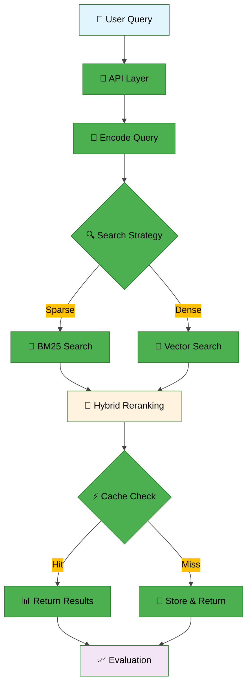
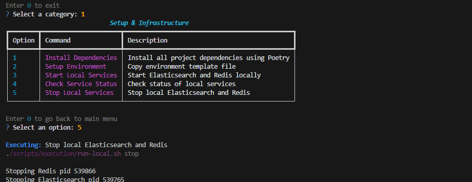
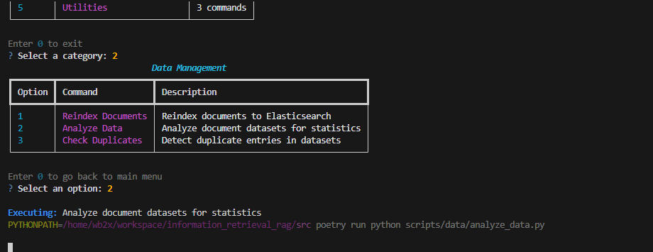
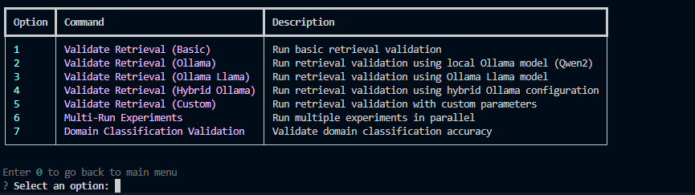
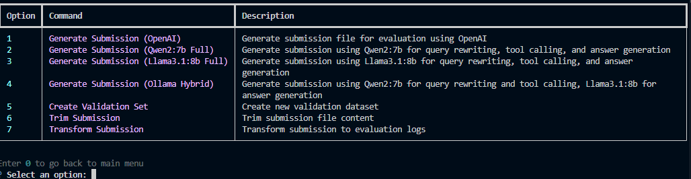
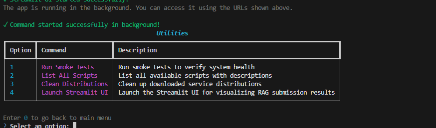

# **Information Retrieval**

과학적 상식 검색을 위한 모듈형 RAG 파이프라인

## 👥 팀 소개
<table>
    <tr>
        <td align="center"></td>
        <td align="center"></td>
        <td align="center"></td>
        <td align="center"></td>
        <td align="center"></td>
    </tr>
    <tr>
        <td align="center"><a href="https://github.com/YOUR_GITHUB">AI13_이상원</a></td>
        <td align="center"><a href="https://github.com/YOUR_GITHUB">AI13_김효석</a></td>
        <td align="center"><a href="https://github.com/Wchoi189">AI13_최용비</a></td>
        <td align="center"><a href="https://github.com/YOUR_GITHUB">AI13_강연경</a></td>
        <td align="center"><a href="https://github.com/YOUR_GITHUB">AI13_정재훈</a></td>
    </tr>
    <tr>
        <td align="center">검색 알고리즘 최적화</td>
        <td align="center">툴 연동, 평가 검증</td>
        <td align="center">베이스라인 제작, readme 작성</td>
        <td align="center">모델 최적화, 프롬트 엔지니어링</td>
        <td align="center">API 개발, Steamlit UI</td>
    </tr>
 </table>


---

## 📋 목차

- [개요](#-개요)
- [대회 정보](#-대회-정보)
- [프로젝트 구조](#-프로젝트-구조)
- [아키텍처](#️-아키텍처)
- [설치 및 실행](#-설치-및-실행)
- [사용법](#-사용법)
- [결과](#-결과)
- [현재 작업](#-현재-작업)

---

## 🚀 빠른 시작

이 프로젝트는 대화형 CLI 메뉴를 제공하여 일반적인 작업을 쉽게 실행할 수 있습니다. 모든 명령은 메뉴를 통해 실행할 수 있습니다.

**대화형 CLI 메뉴 실행**

```bash
# 프로젝트 루트에서 실행
poetry run poetry run python scripts/cli_menu.py
```

메뉴를 통해 다음 작업들을 수행할 수 있습니다:
- 초기 설정 및 인프라 구축
- 데이터 관리 및 색인
- 실험 및 검증 실행
- 평가 및 제출 파일 생성
- 유틸리티 기능

> 자세한 메뉴 설명은 아래의 **사용법** 섹션을 참고하세요.
> 실험 및 고급 사용법에 대한 더 자세한 안내는 **[워크플로우 가이드](docs/usage/workflow-guide.md)**를 참고하세요.
> 병렬 처리에 대한 자세한 정보는 **[병렬 처리 가이드](docs/usage/parallel-processing-guide.md)**를 참고하세요.
## **🎯 개요**

### **환경 요구사항**

| 구분 | 사양 |
| OS | Ubuntu 20.04 (권장) |
| Python | 3.10 |
| 의존성 관리 | Poetry |
| 필수 도구 | curl, tar, make, gcc |

### **주요 기능**

* ✅ Elasticsearch + Redis 기반 인덱싱 및 캐싱
* ✅ 모듈형 RAG 파이프라인
* ✅ **병렬 처리 지원**: 대규모 분석 시 자동 성능 최적화
* ✅ 임베딩, 검색, 평가 유틸리티 제공
* ✅ Docker 없는 로컬 개발 환경 지원
* ✅ Ollama 통합: 비용 효율적인 로컬 AI 모델

## **🏆 대회 정보**

### **📊 개요**

과학적 상식 검색 작업을 위한 Information Retrieval 시스템 구축

### **📅 일정**

* **시작 날짜**: 2025-09-08
* **최종 제출**: 2025-09-18 (19:00)

### **📈 평가 지표**

* **주요 지표**: MAP (Mean Average Precision)
* **데이터셋**: 인덱싱용 4,272개 문서, 평가용 220개 쿼리

## **📁 프로젝트 구조**
```
📦 프로젝트 루트
├── 📄 README.md
├── 📄 pyproject.toml
├── 📄 poetry.lock
├── 📄 poetry.toml
├── 📄 pytest.ini
├── 📂 conf/
├── 📂 data/
├── 📂 docs/
│   ├── 📂 assets/
│   ├── 📂 notes/
│   ├── 📂 planning/
│   ├── 📂 usage/
│   └── 📂 current-work/
│       ├── 📄 README.md
│       ├── 📄 screenshots.md
│       └── 📄 development-plans.md
├── 📂 scripts/
├── 📂 src/
├── 📂 tests/
└── ... (other standard dirs)
```
### **🔧 주요 컴포넌트**

| 모듈 | 기능 | 주요 함수 |
|------|------|-----------|
| **api** | 메인 인터페이스 | `index_documents_from_jsonl()` |
| **embeddings** | 임베딩 처리 | `encode_texts()`, `encode_query()`, `load_model()` |
| **retrieval** | 검색 엔진 | `sparse_retrieve()`, `dense_retrieve()`, `hybrid_retrieve()` |
| **generation** | 텍스트 생성 | `get_generator()`, `get_query_rewriter()` |
| **orchestration** | 파이프라인 조율 | `Pipeline`, `QueryRewriter` |
| **tools** | 도구 스키마 | `ScientificSearchArgs`, `dispatcher()` |
| **analysis** | 분석 및 시각화 | `QueryAnalyzer`, `RetrievalAnalyzer`, `Visualizer` |
| **config** | 설정 관리 | `Settings` |
| **infra** | 인프라 관리 | `get_es()`, `count_docs_with_embeddings()` |
| **utils** | 유틸리티 | `read_jsonl()`, `write_jsonl()`, `configure_logging()` |
| **evaluation** | 평가 메트릭 | `precision_at_k()`, `mrr()` |


## **🏗️ 아키텍처**

### **시스펨 플로우**



* 데이터 플로우 (요약)
  1. 사용자 쿼리 → API 수신
  2. 쿼리 임베딩 생성(임베딩 엔진)
  3. 검색 전략 선택(BM25 / Vector / Hybrid)
  4. 검색 결과를 재랭킹 및 캐시 확인(Redis)
  5. 결과 반환 및 평가 저장

> 자세한 아키텍처 다이어그램은 [시스템 개요](docs/assets/diagrams/system-overview.md), [RAG 아키텍처](docs/assets/diagrams/rag-architecture.md), [시퀀스 플로우](docs/assets/diagrams/system-sequence-flow.md)를 참고하세요.

## **🚀 설치 및 실행**

### **1️⃣ 저장소 클론**

```bash
git clone https://github.com/AIBootcamp13/upstageailab-ir-competition-upstageailab-information-retrieval_2.git
cd upstageailab-ir-competition-upstageailab-information-retrieval_2
```
### **2️⃣ 의존성 설치**

```bash
# Poetry를 사용한 의존성 설치
poetry install
```


### **3️⃣ 서비스 시작**

로컬 Elasticsearch와 Redis를 시작하려면 대화형 CLI 메뉴의 **Setup & Infrastructure** 카테고리를 사용하세요:

```bash
poetry run python scripts/cli_menu.py
```

메뉴에서 다음 옵션들을 선택할 수 있습니다:
- Start Local Services: 로컬 서비스 시작
- Check Service Status: 서비스 상태 확인
- Stop Local Services: 서비스 중지

### **4️⃣ 초기 데이터 인덱싱**

데이터 색인은 대화형 CLI 메뉴의 **Data Management** 카테고리를 통해 수행합니다:

```bash
poetry run python scripts/cli_menu.py
```

**Reindex Documents** 옵션을 선택하여 Elasticsearch에 문서를 색인할 수 있습니다.

환경 관련 팁:

* 항상 `poetry run` 또는 `poetry shell`로 가상환경을 활성화하세요. 에디터가 가상환경을 사용하지 않으면 pydantic/tqdm 등이 "탐지되지 않음"으로 표시될 수 있습니다.
* VSCode 사용 시, 왼쪽 하단 또는 Command Palette에서 Poetry 가상환경을 선택해 인터프리터를 맞추면 편리합니다.

### 재인덱싱(재구축) 사용법

데이터 재색인은 CLI 메뉴의 **Data Management** 카테고리에서 **Reindex Documents** 옵션을 통해 쉽게 수행할 수 있습니다. 수동으로 실행해야 하는 경우:

```bash
PYTHONPATH=src poetry run python scripts/maintenance/reindex.py data/documents.jsonl --index test --batch-size 500
```

팁:
* 배치 사이즈(`--batch-size`)를 늘리면 네트워크 왕복 횟수가 줄어들어 전체 속도가 빨라질 수 있지만, 메모리/ES 부하를 고려하세요.
* ES가 로컬에 없거나 테스트용으로 동작하지 않는 경우 `--index`를 임의의 값으로 지정해도 에러가 발생할 수 있습니다.
* 에디터에서 `elasticsearch`나 `tqdm` 같은 라이브러리가 "해결되지 않음"으로 보이면 VSCode의 Python 인터프리터를 Poetry venv로 설정하세요.

### 테스트 데이터 인프런스 (대회 제출용)

제출 파일 생성은 CLI 메뉴의 **Evaluation & Submission** 카테고리를 통해 수행합니다:

```bash
poetry run poetry run python scripts/cli_menu.py
```

다양한 모델 옵션(OpenAI, Qwen2, Llama 등)을 선택하여 제출 파일을 생성할 수 있습니다.

---

## � 사용법

### 대화형 CLI 메뉴

프로젝트의 모든 주요 작업은 대화형 CLI 메뉴를 통해 수행할 수 있습니다. 메뉴는 다음과 같은 카테고리로 구성되어 있습니다:

> **📝 참고**: 새로운 주요 기능이 추가될 때마다 CLI 메뉴 옵션을 해당 카테고리에 업데이트하세요:
> - **Setup & Infrastructure**: 인프라 설정 및 관리
> - **Data Management**: 데이터 처리 및 색인
> - **Experiments & Validation**: 모델 검증 및 테스트
> - **Evaluation & Submission**: 제출 파일 생성 및 평가
> - **Utilities**: 테스트, 모니터링 및 헬퍼 도구

#### 1. Setup & Infrastructure
프로젝트 인프라 설정 및 관리 기능을 제공합니다. 의존성 설치, 환경 설정, 로컬 서비스(Elasticsearch, Redis) 시작/중지 등의 작업을 수행할 수 있습니다.

<p align="center">
  
</p>

#### 2. Data Management
문서 데이터의 색인, 분석, 중복 검사 등의 데이터 관리 작업을 지원합니다. Elasticsearch에 문서를 효율적으로 색인하고 데이터 품질을 검증할 수 있습니다.

<p align="center">
  
</p>

#### 3. Experiments & Validation
검색 성능 검증 및 실험을 위한 다양한 옵션을 제공합니다. 기본 검증부터 Ollama 모델을 활용한 고급 실험까지 지원하며 병렬 처리도 가능합니다.

<p align="center">
  
</p>

#### 4. Evaluation & Submission
대회 제출용 파일 생성 및 평가 작업을 수행합니다. 다양한 모델(OpenAI, Qwen2, Llama 등)을 선택하여 최적의 제출 파일을 생성할 수 있습니다.

<p align="center">
  
</p>

#### 5. Utilities
시스템 상태 확인, 스크립트 목록 조회, Streamlit UI 실행 등의 유틸리티 기능을 제공합니다. 프로젝트 유지보수 및 모니터링에 유용합니다.

<p align="center">
  
</p>

---

## �📊 결과

### 🏅 성능 지표

| 메트릭 | 점수 | 비고 |
|--------|------|------|
| **MAP** | 0.XXX | Mean Average Precision |
| **MRR** | 0.XXX | Mean Reciprocal Rank |
| **Precision@10** | 0.XXX | 상위 10개 결과 정확도 |

### 📈 리더보드

> 리더보드 스크린샷 및 순위 정보를 여기에 추가하세요.

### 🎯 주요 성과

- ✅ **모듈형 아키텍처**: 각 컴포넌트의 독립적 개발 및 테스트 가능
- ✅ **하이브리드 검색**: BM25와 Dense Vector의 효과적 결합
- ✅ **캐싱 최적화**: Redis를 통한 응답 속도 개선
- ✅ **확장 가능성**: 새로운 임베딩 모델 및 검색 전략 쉽게 추가 가능

---
<!--
## 🚧 현재 작업

### 📋 진행 중인 작업

<details>
<summary><strong>🔄 리팩토링 및 정리 작업</strong></summary>

현재 프로젝트의 구조를 개선하고 문서를 정리하는 작업을 진행 중입니다:

- ✅ **스크립트 재구성**: 로컬 서비스 관리 스크립트들을 적절한 디렉토리로 재배치
- ✅ **문서 정리**: 중복된 문서 제거 및 최신 정보로 업데이트
- ✅ **다이어그램 개선**: 시스템 아키텍처 다이어그램의 명확성 향상
- 🔄 **README 최적화**: 사용자 경험 개선을 위한 문서 구조 개선

</details>

<details>
<summary><strong>📊 성능 최적화</strong></summary>

시스템 성능 향상을 위한 다양한 최적화 작업을 계획 중입니다:

- 🔄 **병렬 처리 개선**: 대용량 데이터 처리 시 성능 최적화
- 🔄 **캐싱 전략 강화**: Redis 활용도 극대화
- 🔄 **메모리 사용 최적화**: Elasticsearch 및 임베딩 모델 메모리 효율성 개선

</details>

<details>
<summary><strong>🔧 개발 환경 개선</strong></summary>

개발자 경험 향상을 위한 환경 개선 작업:

- ✅ **로컬 개발 환경**: Docker 없는 완전한 로컬 개발 환경 구축
- 🔄 **CI/CD 파이프라인**: 자동화된 테스트 및 배포 프로세스 구축
- 🔄 **모니터링 도구**: 시스템 상태 모니터링 및 로깅 개선

</details>

### 📸 스크린샷 및 시각화

> 현재 작업 중인 기능과 개선사항에 대한 스크린샷은 [작업 진행 상황](docs/current-work/screenshots.md)에서 확인하실 수 있습니다.

### 📝 상세 계획

> 앞으로의 개발 계획과 로드맵은 [개발 계획](docs/current-work/development-plans.md)에서 확인하실 수 있습니다. -->

---


## � 참고 자료

### 📖 문서

- [프로젝트 상세 개요](docs/notes/project-overview.md)
- [Docker 없는 개발 환경](docs/docker-less.md)
- [스모크 테스트 가이드](docs/usage/smoke-test.md)
- [트러블슈팅 가이드](docs/usage/troubleshooting.md)
- [현재 작업 스크린샷](docs/current-work/screenshots.md)
- [개발 계획 및 로드맵](docs/current-work/development-plans.md)
- [현재 작업 개요](docs/current-work/README.md)

###  유용한 링크

- [Elasticsearch 공식 문서](https://www.elastic.co/guide/en/elasticsearch/reference/8.9/index.html)
- [Redis 공식 문서](https://redis.io/documentation)
- [HuggingFace Transformers](https://huggingface.co/docs/transformers/index)

---

## 📄 라이선스

이 프로젝트는 MIT 라이선스 하에 배포됩니다.

---

<div align="center">

<!-- **🚀 Made with ❤️ by Team Information Retrieval** -->

[](https://python.org)
[](https://elastic.co)
[](https://redis.io)
[](https://python-poetry.org)

</div>
