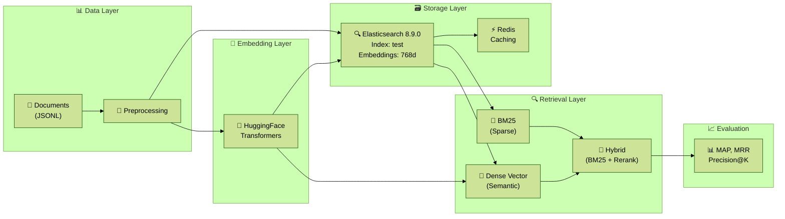

### RAG 파이프라인 구조

```mermaid
---
config:
  theme: "forest"
---
flowchart LR
  subgraph "📊 Data Layer"
    docs["📄 Documents<br/>(JSONL)"]
    preprocess["🔄 Preprocessing"]
  end

  subgraph "🗃️ Storage Layer"
    es["🔍 Elasticsearch 8.9.0<br/>Index: test<br/>Embeddings: 768d"]
    redis["⚡ Redis<br/>Caching"]
  end

  subgraph "🧠 Embedding Layer"
    hf["🤗 HuggingFace<br/>Transformers"]
  end

  subgraph "🔍 Retrieval Layer"
    bm25["📝 BM25<br/>(Sparse)"]
    dense["🎯 Dense Vector<br/>(Semantic)"]
    hybrid["🔀 Hybrid<br/>(BM25 + Rerank)"]
  end

  subgraph "📈 Evaluation"
    metrics["📊 MAP, MRR<br/>Precision@K"]
  end

  docs --> preprocess
  preprocess --> es
  preprocess --> hf
  hf --> es
  es --> redis

  es --> bm25
  es --> dense
  hf --> dense

  bm25 --> hybrid
  dense --> hybrid

  hybrid --> metrics
```