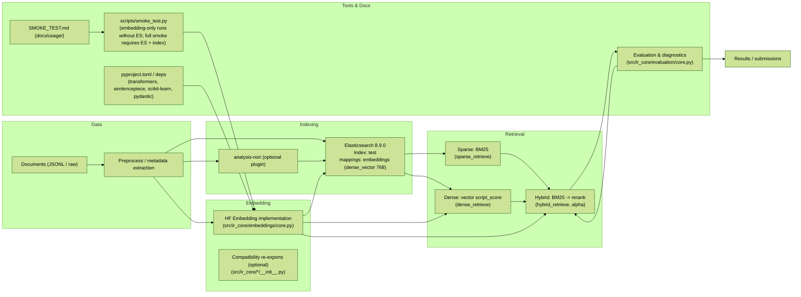

```mermaid
%%{ init: { 'theme': 'forest' } }%%
flowchart LR
  subgraph "Data"
    docs["Documents (JSONL / raw)"]
    preprocess["Preprocess / metadata extraction"]
  end

  subgraph "Indexing"
    nori["analysis-nori (optional plugin)"]
    es["Elasticsearch 8.9.0<br/>Index: test<br/>mappings: embeddings (dense_vector 768)"]
  end

  subgraph "Embedding"
    hf["HF Embedding implementation<br/>(src/ir_core/embeddings/core.py)"]
    compat["Compatibility re-exports (optional)<br/>(src/ir_core/*/__init__.py)"]
  end

  subgraph "Retrieval"
    bm25["Sparse: BM25<br/>(sparse_retrieve)"]
    dense["Dense: vector script_score<br/>(dense_retrieve)"]
    hybrid["Hybrid: BM25 -> rerank<br/>(hybrid_retrieve, alpha)"]
  end

  subgraph "Tools & Docs"
    smoke["scripts/smoke_test.py<br/>(embedding-only runs without ES; full smoke requires ES + index)"]
    eval["Evaluation & diagnostics<br/>(src/ir_core/evaluation/core.py)"]
    config["pyproject.toml / deps<br/>(transformers, sentencepiece, scikit-learn, pydantic)"]
    docs_md["SMOKE_TEST.md (docs/usage/)"]
  end

  docs --> preprocess
  preprocess --> es
  preprocess --> nori
  nori --> es

  preprocess --> hf
  hf --> es

  es --> bm25
  es --> dense
  hf --> dense
  bm25 --> hybrid
  dense --> hybrid
  hf --> hybrid

  smoke --> hf
  eval --> hybrid
  config --> hf
  docs_md --> smoke

  hybrid --> eval
  eval --> results["Results / submissions"]
```