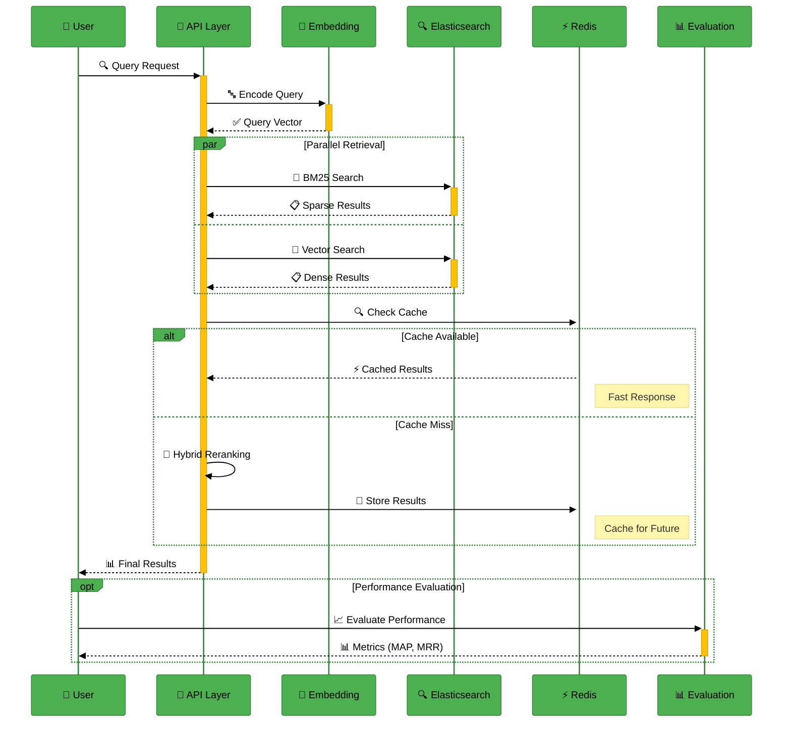

### 시스템 플로우 (상세)

```mermaid
---
config:
  theme: "base"
  themeVariables:
    background: "#ffffff"
    primaryColor: "#4CAF50"
    primaryTextColor: "#000000"
    primaryBorderColor: "#2E7D32"
    lineColor: "#424242"
    secondaryColor: "#FFC107"
    tertiaryColor: "#FF5722"
---
sequenceDiagram
    participant U as 👤 User
    participant API as 🔌 API Layer
    participant EMB as 🧠 Embedding
    participant ES as 🔍 Elasticsearch
    participant R as ⚡ Redis
    participant EVAL as 📊 Evaluation

    U->>+API: 🔍 Query Request
    API->>+EMB: 🔤 Encode Query
    EMB-->>-API: ✅ Query Vector

    par Parallel Retrieval
        API->>+ES: 📝 BM25 Search
        ES-->>-API: 📋 Sparse Results
    and
        API->>+ES: 🎯 Vector Search
        ES-->>-API: 📋 Dense Results
    end

    API->>+R: 🔍 Check Cache
    alt Cache Available
        R-->>API: ⚡ Cached Results
        Note right of R: Fast Response
    else Cache Miss
        API->>API: 🔀 Hybrid Reranking
        API->>R: 💾 Store Results
        Note right of R: Cache for Future
    end

    API-->>-U: 📊 Final Results

    opt Performance Evaluation
        U->>+EVAL: 📈 Evaluate Performance
        EVAL-->>-U: 📊 Metrics (MAP, MRR)
    end

```