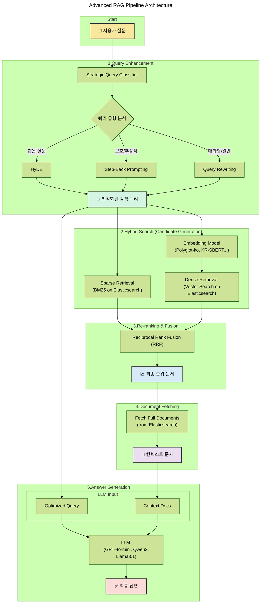

```mermaid
---
title: Advanced RAG Pipeline Architecture
config:
  theme: "forest"
---
flowchart TD
    subgraph "Start"
        A["👤 사용자 질문"]
    end

    subgraph "1.Query Enhancement"
        direction LR
        B[Strategic Query Classifier]
        C{쿼리 유형 분석}
        D[HyDE]
        E[Step-Back Prompting]
        F[Query Rewriting]
        G[✨ 최적화된 검색 쿼리]

        A --> B
        B --> C
        C -->|모호/추상적| E
        C -->|짧은 질문| D
        C -->|대화형/일반| F
        D --> G
        E --> G
        F --> G
    end

    subgraph "2.Hybrid Search (Candidate Generation)"
        H["Sparse Retrieval <br> (BM25 on Elasticsearch)"]
        I["Dense Retrieval <br> (Vector Search on Elasticsearch)"]
        J["Embedding Model <br> (Polyglot-ko, KR-SBERT...)"]

        G --> H
        G --> J --> I
    end

    subgraph "3.Re-ranking & Fusion"
        K["Reciprocal Rank Fusion (RRF)"]
        L["📈 최종 순위 문서"]
        H --> K
        I --> K
        K --> L
    end

    subgraph "4.Document Fetching"
        M["Fetch Full Documents <br> (from Elasticsearch)"]
        N["📄 컨텍스트 문서"]
        L --> M --> N
    end

    subgraph "5.Answer Generation"
        O["LLM <br> (GPT-4o-mini, Qwen2, Llama3.1)"]
        P["✅ 최종 답변"]
        subgraph "LLM Input"
            direction LR
            G_dup1[Optimized Query]
            N_dup1[Context Docs]
        end
        G --> G_dup1
        N --> N_dup1
        G_dup1 --> O
        N_dup1 --> O
        O --> P
    end

    style A fill:#F9E79F,stroke:#333,stroke-width:2px
    style G fill:#D5F5E3,stroke:#333,stroke-width:2px
    style L fill:#D6EAF8,stroke:#333,stroke-width:2px
    style N fill:#EBDEF0,stroke:#333,stroke-width:2px
    style P fill:#FADBD8,stroke:#333,stroke-width:2px

```